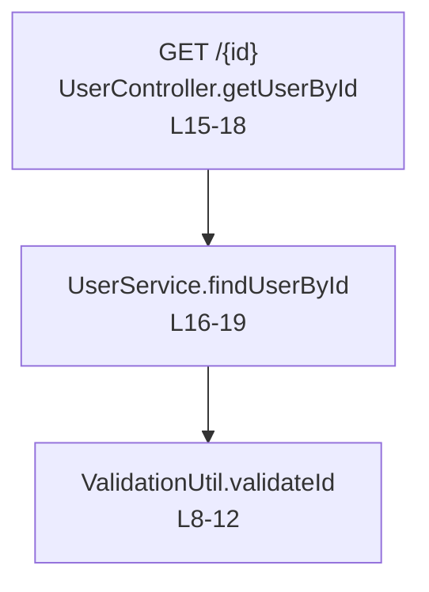

# Java Navigator - Java代码函数调用关系分析工具

Java Navigator 是一个用于解析Java工程代码并生成函数调用关系图的Python工具。

## 功能特性

- 解析Java 21项目的源代码
- 提取函数定义和调用关系
- 生成Mermaid格式的函数调用关系图
- 支持REST API接口路径映射
- 只分析src目录下的源代码文件
- 提供详细的函数信息（文件路径、行数、调用关系等）

## 使用方法

### 基本语法

```bash
python3 java_navigator.py <function_name> <project_dir>
```

### 参数说明

- `function_name`: 要分析的函数名称，支持以下格式：
  - 函数名：`getUserById`
  - 类.方法名：`UserController.getUserById`
  - REST接口路径：`"/api/users/{id}"`
- `project_dir`: Java工程所在的目录路径（必须包含src文件夹）

### 可选参数

- `--max-depth N`: 设置函数调用链的最大深度（默认：10）
- `--verbose`: 显示详细的解析过程信息
- `--help`: 显示帮助信息

### 使用示例

```bash
# 分析getUserById函数的调用链
python3 java_navigator.py getUserById ./test/java-project

# 分析特定类的方法
python3 java_navigator.py UserController.createUser ./test/java-project

# 通过REST接口路径查找函数
python3 java_navigator.py "/api/users/{id}" ./test/java-project

# 设置最大调用深度
python3 java_navigator.py getUserById ./test/java-project --max-depth 5

# 启用详细输出模式
python3 java_navigator.py createUser ./test/java-project --verbose
```

## 输出格式

工具会输出以下内容：

1. **Mermaid格式的函数调用关系图**
   ```mermaid
   graph TD
       node0["GET /{id}\nUserController.getUserById\nL15-18"]
       node1["UserService.findUserById\nL16-19"]
       node2["ValidationUtil.validateId\nL8-12"]
       node0 --> node1
       node1 --> node2
   ```

2. **函数调用链摘要**
   - 链路中的函数总数
   - 起始函数信息
   - REST接口信息（如适用）

3. **详细函数信息**
   - 函数名称和所属类
   - 文件路径和起止行数
   - 是否为公共方法
   - 调用的其他函数列表
   - REST接口信息（如适用）

## 项目结构

```
.
├── java_navigator.py      # 主入口程序
├── java_parser.py         # Java代码解析器
├── call_graph_analyzer.py # 调用关系分析器
├── test/                  # 测试项目
│   └── java-project/      # Spring Boot测试项目
│       ├── pom.xml
│       └── src/
│           └── main/java/com/example/
│               ├── Application.java
│               ├── controller/UserController.java
│               ├── service/UserService.java
│               ├── repository/UserRepository.java
│               ├── dto/UserResponse.java
│               └── util/ValidationUtil.java
└── README.md
```

## 测试项目

项目包含了一个简单的Spring Boot测试项目，位于`test/java-project/`目录下。这个项目包含：

- **UserController**: REST控制器，提供用户相关的API接口
- **UserService**: 业务逻辑层
- **UserRepository**: 数据访问层
- **ValidationUtil**: 验证工具类
- **UserResponse**: 数据传输对象

测试项目展示了典型的Spring Boot应用结构和函数调用关系。

## 系统要求

- Python 3.6+
- Java工程必须包含src目录
- 支持Java 21语法特性

## 限制说明

- 目前仅支持src目录下的Java文件分析
- 函数调用解析基于简单的正则表达式匹配
- 不支持动态方法调用和反射
- 对于复杂的泛型和Lambda表达式支持有限

## 示例运行结果

```bash
$ python3 java_navigator.py getUserById ./test/java-project

正在解析Java工程...
成功解析到 23 个函数
找到多个匹配的函数，使用第一个: UserController.getUserById
  其他匹配: UserRepository.getUserById

分析函数调用链: UserController.getUserById

============================================================
函数调用关系图 (Mermaid格式)
============================================================



=== Call Chain Summary ===
Total functions in chain: 3
Starting function: UserController.getUserById
REST Endpoint: GET /{id}

=== Function Information ===

1. UserController.getUserById
   REST Endpoint: GET /{id}
   File: ./test/java-project/src/main/java/com/example/controller/UserController.java
   Lines: 15-18
   Public: Yes
   Calls: UserService.findUserById

2. UserService.findUserById
   File: ./test/java-project/src/main/java/com/example/service/UserService.java
   Lines: 16-19
   Public: Yes
   Calls: ValidationUtil.validateId

3. ValidationUtil.validateId
   File: ./test/java-project/src/main/java/com/example/util/ValidationUtil.java
   Lines: 8-12
   Public: Yes
   Calls: None

============================================================
分析完成!
```

## 贡献

欢迎提交Issue和Pull Request来改进这个工具！